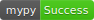
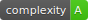

<div align="center">

# Boilerplate for Python Dash Projects

[](https://github.com/MaaniBeigy/dash-boilerplate/actions?query=workflow%3Abuild)
[](.logs/coverage.txt)
[](.logs/mypy.txt)
[](.logs/safety.txt)
[](.logs/pylint-log.txt)
[](.logs/dependencies.txt)
[](https://app.fossa.com/projects/git%2Bgithub.com%2FMaaniBeigy%2Fdash-boilerplate?ref=badge_shield)

[](.logs/docstring.txt)
[](.logs/maintainability.txt)
[](.logs/complexity.txt)
[](https://github.com/psf/black)
[](https://github.com/PyCQA/bandit)
[](.pre-commit-config.yaml)
[](LICENSE)

Production-ready (i.e., dockerized) dash app boilerplate

</div>

### Development

Uses gunicorn + nginx.

1. Rename *.env.dev.example* to *.env.dev*.
2. Update the environment variables in the *docker-compose.yml* and *.env.dev* files.
3. Build the images and run the containers:

    ```sh
    docker-compose up -d --build
    ```
    Test it out at [http://localhost:1337](http://localhost:1337). The "web" folder is mounted into the container and your code changes apply automatically.

4. Check the logs if necessary:

    ```sh
    docker-compose -f docker-compose.yml logs -f
    ```

5. Drop the container when you are done:

    ```sh
    docker-compose -f docker-compose.yml down -v
    ```


### Production

Uses gunicorn + nginx.

1. Rename *.env.prod.example* to *.env.prod*. Update the environment variables.
2. Build the images and run the containers:

    ```sh
    docker-compose -f docker-compose.prod.yml up -d --build
    ```
    Test it out at [http://localhost:1337](http://localhost:1337). No mounted folders. To apply changes, the image must be re-built.


3. Check the logs if necessary:

    ```sh
    docker-compose -f docker-compose.prod.yml logs -f
    ```

4. Drop the container when you are done:

    ```sh
    docker-compose -f docker-compose.prod.yml down -v
    ```

### Local testing and generating badges:

```bash
python3.9 -m venv .venv_39
. .venv_39/bin/activate
python3 -m pip install --upgrade pip poetry
make install
make pre-commit-install
make test && make coverage && make check-codestyle && make mypy && make check-safety && make extrabadges
```

### Upload code to GitHub:

```bash
pre-commit run --all-files
git add .
git commit -m ":tada: Initial commit"
git push -u origin main
```

### Credits

[testdrivenio/flask-on-docker](https://github.com/testdrivenio/flask-on-docker)


## License
[](https://app.fossa.com/projects/git%2Bgithub.com%2FMaaniBeigy%2Fdash-boilerplate?ref=badge_large)